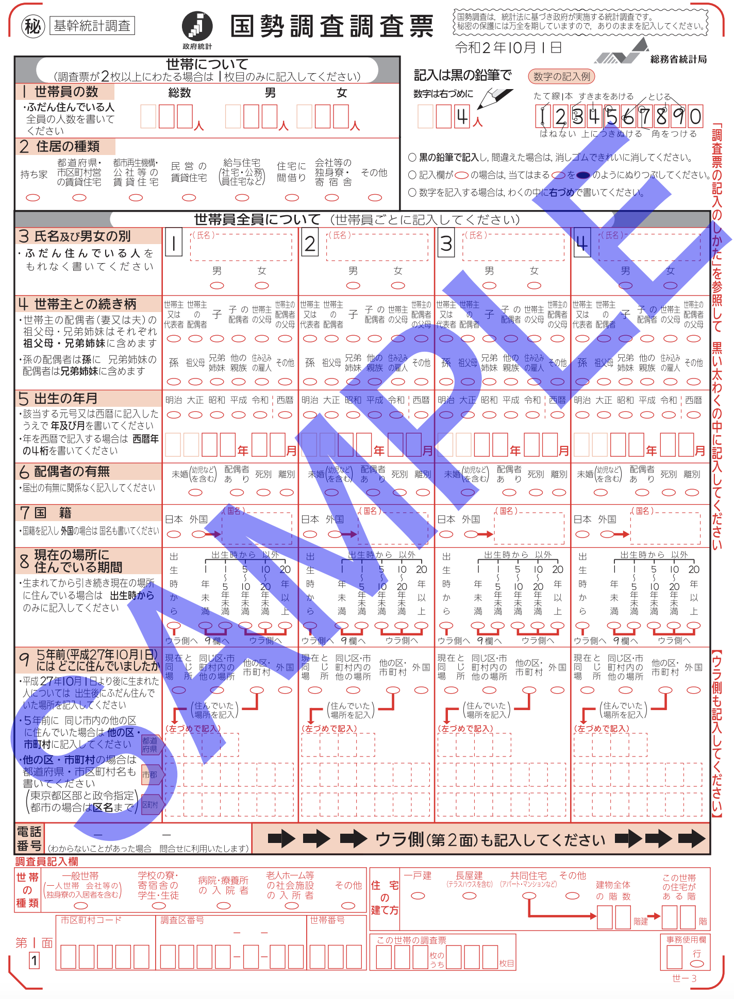
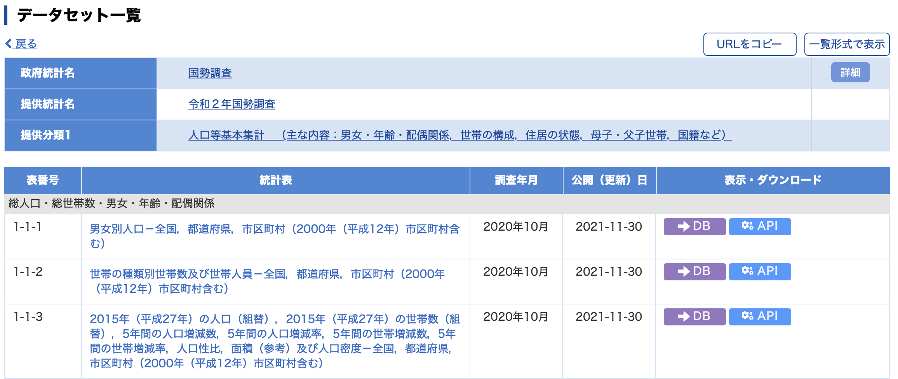
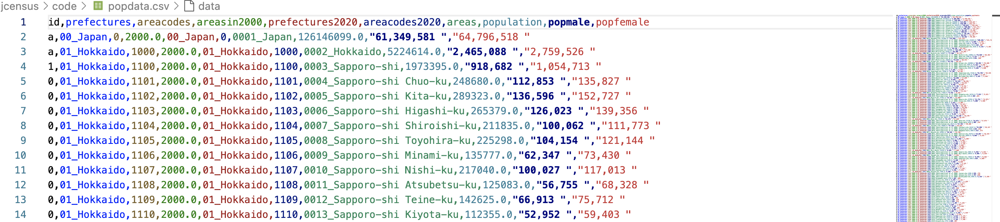
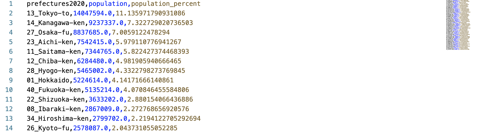

# 僕の夏の目標: コンピューターサイエンスとび積分を学ぶ

この夏は、アメリカ人のお父さんと一緒に長い時間を過ごして、コンピュータサイエンスについていろいろ学びました。マイクロプロセッサーがどう動くのか、Linuxのようなオペレーティングシステムの仕組みとか、ソフトウェアエンジニアリングの基本について教えてもらいました。それに、Pythonというプログラミング言語を使ってデータサイエンスも学びました。Pythonはもう2年くらい勉強していますが、夏休みはさらに深く学ぶことができました。また、時間があるときにび積分もちょっと勉強しました。そして、僕は数学を楽しいと思いました。

夏休み中に学んだことを活かして、自分でプロジェクトを行おうと思いました。日本の都道府県ごとの人口割合を計算するプロジェクトを選びました。

けれども、まずはどうやって行うか考えなきゃいけませんでした。そこで、検索をしました。検索中に、目標を達成するために役立つ面白いことがたくさん見つかりました。

日本には、ほとんどの国と同じように、国勢調査を行う機関があります。これで政府が人口を数えています。そのデータは国勢調査局が集めていて、政府で利用されています。

## 国勢調査

政府は人口に関する詳しい情報をたくさん持っていますが、僕はプログラムを書くために必要なデータファイルがどこにあるか探す必要がありました。そこで、日本には日本統計局（JBS）があって、いろいろな政府機関が集めた情報や統計を管理していることを知りました。その情報の多くは、e-Statというサービスを通じて誰でも無料で見ることができるんです。ウェブサイトにあるファイルは、自分で書いたプログラムで使える形式になっていて、すごく役に立ちました。

## データソース

僕は必要なファイルを見つけて、ダウンロードしました。コンピューターにファイルが入ったあとは、政府がそのデータをどう整理しているか、そしてそれをどう使われているを分析しました。データには、01から47までの数字があって、それが日本の都道府県に対応していることが分かりました。例えば、01は北海道を表していて、47は沖縄です。これでデータが地理的順序で並んでいることでわかりやすくなりました。

## CSVファイル 

これが分かれば、01から47までの各都道府県の総人口を見つけるプログラムを書くのは簡単でした。その上に、各都道府県の横に総人口、男性、女性を示す3つの列があったので、助かりました。そこで、Pythonでファイル内のデータを読み込むプログラムを書きました。

## Pythonプログラム

都道府県の人口をすべての都道府県の総人口で割って、その計算結果を新しいデータファイルにまとめました。データサイエンスでは、これを人口統計分析と呼ぶそうです。

うまくいきました！

結果が正しいかどうか手作業で確認しました。次の課題は、プログラムの結果を簡単に見やすく、日本全体の都道府県人口として表示する方法を考えることでした。

そして、これがその結果です。

## 視覚化された出力

結果を見るにはここを訪れてください: [Link to map.md](./map.md)

すごく楽しかったです！夏休みに学んだことを活かして、コンピュータサイエンスで実際にやってみることができました。みんなもぜひやってみてください。

