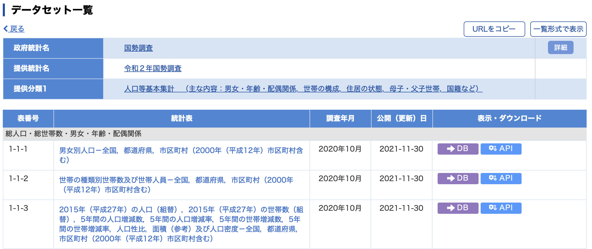
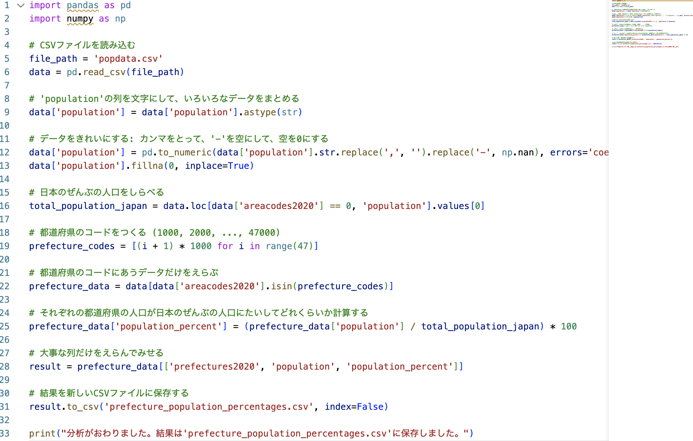

# My Summer Goal: Learn Computer Science and Calculus

Over the summer, I spent a lot of time with my father, who is a computer scientist from America. I learned a lot about how microprocessors work and the architecture of operating systems like Linux, along with concepts in software engineering. I also learned data science using the Python programming language, which I have been studying for almost 2 years. Plus, I studied some calculus in my free time because I think math is fun.

I decided to use what I learned over the summer for my own project as a challenge. I chose to calculate the population percentages of Japan’s prefectures using the skills I gained.

But first, I needed to figure out how to do this. So, I did some research. During my research, I found many interesting things that would help me reach my goal of calculating the population by prefecture.

Like most modern countries, Japan has a census bureau that sends a survey to all households. This is how the government counts people. The information is collected by the census bureau for the national government.

## - Census Survey -

The government has a lot of detailed information about the population, but I needed to find where I could get the actual data files I needed for the program I wanted to write. I found out that there is a Japan Bureau of Statistics (JBS) which keeps information and statistics collected by different government agencies. Much of this information is free to the public through a service called e-Stat. The files on their website are designed to be used with computer programs, including ones that you write on your own. This was very helpful in reaching my goal.

## — Data Source —

I found the exact file I needed and downloaded it. Now that I had the file on my computer, I needed to analyze the data inside it to figure out how the government organized it and how to use it. I discovered that in the data, there were numbers 01-47 that matched the prefectures of Japan. For example, 01 represented Hokkaido, and 47 represented Okinawa. This made it easy to understand that the data is sorted by these prefectures in geographic order.

## - Spreadsheet -  
  

Knowing this, I could quickly write a program that finds the total population of each prefecture from 01-47. That was easy because next to each prefecture were 3 more columns that showed the total population, male, and female by prefecture. So, I wrote a program in the Python language to read all of the data in the file.

## - Python Program -

I divided a prefecture’s population by the total population of all the prefectures and then created a new data file that included the calculated results. In data science, this is called a demographic analysis.

It worked!

I checked the information manually to make sure everything was correct. The next challenge was to create a simple way to take my program results and visually show the prefecture population across Japan.

And this is how it turned out.

## - Visualized Output -

## Visit here for the result: [MAP](./map.md)

This was so much fun! It helped me apply what I learned over the summer in computer science and you can try too.

[JAPANESE](./README.md)
