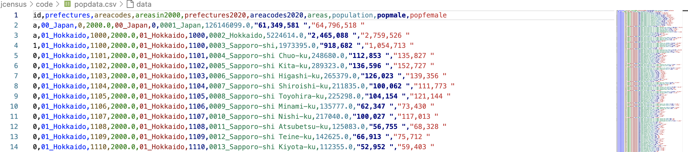

DELIVER ESSAY FOR CLASSROOM DUE IN 1 DAY

Goal: the goal

The process, the steps needed done.

Identify where data comes from, can I get it? Ah yes, I can get it at Japan statistics bureau…

Greet, but Delia, I need this in a form my computer read so I can use this in a program… hmm… how do I do that… I found Japan stores statistics from different agencies/miitries at a specific place called eStats… 

— JAPAN KEY STIES JBS, estat… —

at e stats the file I needed on the census data was a available in computer form for free.

  
Greet, now I download that to my computer and take a look at what inside… there’s a lot information, but most interesting is discovering inside the file that Japan codes the prefectures 

between 01-47 in the data and then breaks down the population by male, female, and total population. 

  

— SPREEDSHEET of the FILE —
›
  
  

Great now I have the information I need to write a computer program in python that will use the information provided by Japan estat website.

  

So I wrote the program to look at 01 thru 47 and 01 is Hokkaido and 47 is equal to Okinawa so ha ha whats in between is ALL of the prefectures ordered by geography. So now my program iterates through this information and performs the calculation to find the percent of the population across all 47 prefectures and added to the original data the percent relative to the total Japan population.

  

— EXAMPLE OF PYTHON PROGRAM —

  

  

  

GREAT, however now I need to display this somehow. SO I decided to write another program which takes the estat + the percent data and generate a computer file to visualize the information. 

  

— VISUALIZED OUTPUT —